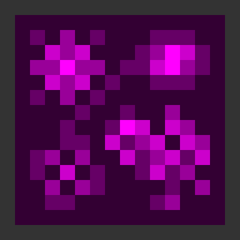
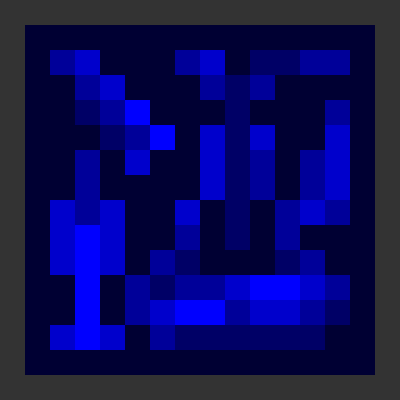
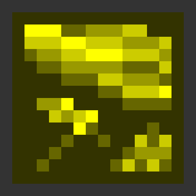
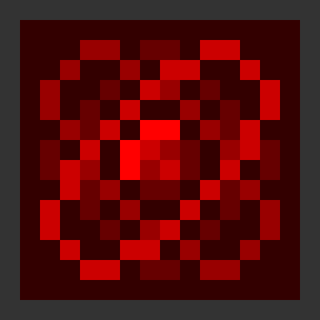
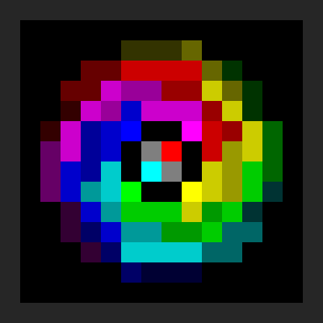

# DegeneracyCraft

[🇺🇸 English](README.md) | 🇯🇵 **日本語**

---

## 概要

**DegeneracyCraft** は、**11の独立した学術分野**を中心に構築された大規模工業MODです。

従来の工業MODのような一本道の技術ツリーではなく、すべての機械・素材・システムはそれぞれ固有の学術分野に属しています。

複数の分野を横断・統合しながら技術を発展させることで、工業技術から惑星工学、並行世界、さらには存在そのものを扱う技術へと到達していきます。

---

## 学術分野

各学術分野には、それぞれ固有の機械・素材・生産方法・技術思想が存在します。

詳しくは **[学術分野ドキュメント](docs/academic_fields_ja.md)** をご覧ください。

---

## Industrial Progress Phase (IPP)

DegeneracyCraft のすべての機械と技術は、**11段階の Industrial Progress Phase（IPP）** のいずれかに分類されます。

IPP は単なる性能の違いではなく、その技術が**どこまで現実へ影響を及ぼせるか**という技術発展の段階を表します。

詳しくは **[Industrial Progress Phase ドキュメント](docs/ipp_ja.md)** をご覧ください。

---

## ドキュメント

- 📖 [学術分野](docs/academic_fields_ja.md)
- ⚙️ [工業進展段階（Industrial Progress Phase）](docs/ipp_ja.md)

---

## 開発状況

⚠ **開発中（Work in Progress）**

DegeneracyCraft は現在も精力的に開発が進められています。

システム・ゲームバランス・機械・ドキュメントは継続的に追加・改善されています。

不具合報告やご意見・ご提案はいつでも歓迎します。