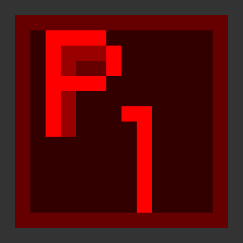
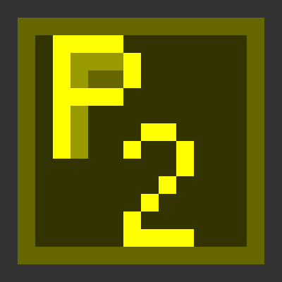
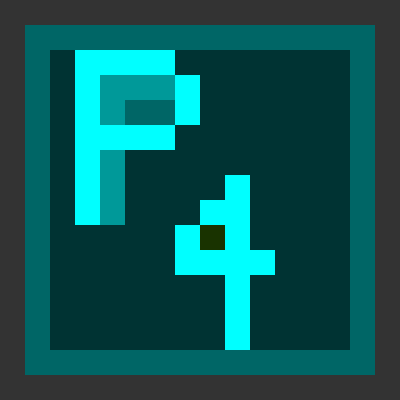
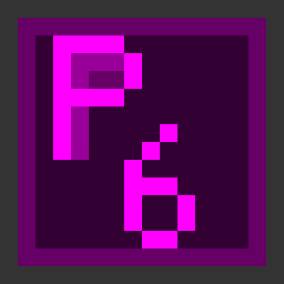
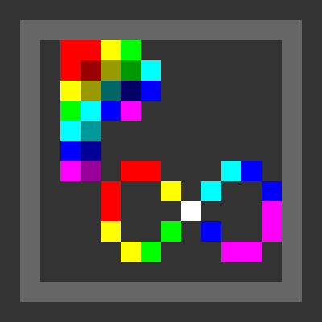

# Industrial Progress Phase（IPP）

**DegeneracyCraft** に登場するすべての機械・技術は、**11段階の Industrial Progress Phase（IPP）** のいずれかに分類されます。

従来の工業MODのように「より強い機械」を目指す技術ツリーとは異なり、IPPは**技術そのものの質的進化**と、その技術が現実へ及ぼせる影響の規模を表します。

IPPの進歩とは、単なる性能向上ではなく、技術が作用できる**現実の階層そのものを拡張していく**過程です。

---

<h1><span style="color:#FFFFFF;">Initial</span></h1>


**概念（Concept）:** 始まり（Beginning）

Minecraft Vanilla と DegeneracyCraft を繋ぐ境界となるフェーズです。

すべての学術分野へ進むための入口であり、DegeneracyCraft の技術体系がここから始まります。

### 特徴

* Vanilla Minecraft からの移行
* 技術発展の導入段階
* 基礎インフラの構築
* 全学術分野の出発点

---

<h1><span style="color:#FF0000;">Basic</span></h1>



**概念（Concept）:** 基盤（Foundation）

単純化された基礎技術の段階です。

限られた設備と理論でも再現可能な、工業化の第一歩となる技術が扱われます。

### 特徴

* 基本機械
* 初期自動化
* 基礎部品
* 基本生産

---

<h1><span style="color:#FFFF00;">Low</span></h1>



**概念（Concept）:** 標準化（Standardization）

安定した生産と継続運用が可能になる技術段階です。

工業システムが標準化され、信頼性のある生産ラインが構築されます。

### 特徴

* 安定生産
* 連続処理
* 標準化された機械
* 持続可能な工業

---

<h1><span style="color:#00FF00;">Medium</span></h1>


**概念（Concept）:** 統合（Integration）

膨大な資源と高度なシステム統合を必要とする、大規模な汎用技術です。

複数の学術分野が連携し、一つの産業システムとして機能し始めます。

### 特徴

* 大規模工業設備
* 学際的システム
* 統合インフラ
* 大量生産

---

<h1><span style="color:#00FFFF;">High</span></h1>



**概念（Concept）:** 精密（Precision）

厳密な理論と高度な制御によって支えられた、高精度・高信頼性の技術です。

機械はさらに洗練され、最適化されたシステムへ進化します。

### 特徴

* 精密工学
* 高度制御
* 高信頼自動化
* 最適化システム

---

<h1><span style="color:#0000FF;">Super</span></h1>


**概念（Concept）:** 理論の先へ（Beyond Theory）

既存の理論的限界を超えた先端技術です。

これまで不可能だった現象が、科学技術によって実現可能になります。

### 特徴

* 特殊工学
* 人工現象
* 極限技術
* 先端科学理論

---

<h1><span style="color:#FF00FF;">Over</span></h1>



**概念（Concept）:** 惑星への干渉（Planetary Influence）

惑星全体へ影響を及ぼせる超越的な技術です。

技術は工場や文明を超え、惑星規模の工学へと発展します。

### 特徴

* 惑星規模インフラ
* 気候制御
* 全地球エネルギー網
* 惑星工学

---

<h1><span style="color:#AAAAAA;">Ultra</span></h1>


**概念（Concept）:** 恒星文明（Stellar Civilization）

恒星系、さらには銀河規模へ影響を及ぼす極限技術です。

工業文明は宇宙へ進出し、天文学的スケールで活動を始めます。

### 特徴

* 恒星工学
* 銀河物流
* 宇宙インフラ
* 恒星間資源利用

---

<h1><span style="color:#333333;">Anti</span></h1>


**概念（Concept）:** 宇宙法則の反転（Universal Inversion）

宇宙そのものの基本構造へ干渉できる反転技術です。

技術は物理法則に従うだけでなく、その法則自体を書き換え始めます。

### 特徴

* 宇宙構造操作
* 物理法則への干渉
* 現実の再構築
* 根源的反転

---

<h1><span style="color:#333">Ima</span><span style="color:#AAA">gin</span><span style="color:#FFF">ary</span></h1>


**概念（Concept）:** 並行存在（Parallel Existence）

並行世界と、存在し得るすべての可能性へ影響を及ぼす絶対的な技術です。

技術は一つの現実を超え、あらゆる分岐した世界へ到達します。

### 特徴

* 並行世界
* 現実分岐
* 多元宇宙技術
* 可能性操作

---

<h1><span style="color:#F00">I</span><span style="color:#FF0">n</span><span style="color:#0F0">fi</span><span style="color:#0FF">ni</span><span style="color:#00F">t</span><span style="color:#F0F">y</span></h1>



**概念（Concept）:** 絶対技術（Absolute Technology）

理解・再現・制御のすべてを超越した究極の技術です。

既知のあらゆる学術体系や概念を超えた、到達点として存在します。

### 特徴

* 理解を超越
* 再現を超越
* 制御を超越
* 定義を超越

---

## 技術の発展

Industrial Progress Phase は、**機械の性能**ではなく、**技術がどこまで発展したか**を表す指標です。

その発展は、技術が影響を及ぼせる範囲が徐々に拡大していく過程として捉えることができます。

```text
機械
      ↓
工場
      ↓
文明
      ↓
惑星
      ↓
恒星系
      ↓
銀河
      ↓
宇宙
      ↓
並行世界
      ↓
無限
```

DegeneracyCraft のすべての機械は、**学術分野（Academic Field）** と **Industrial Progress Phase（IPP）** の両方に属しています。

**Academic Field** は、その技術が**何を研究・扱うのか**を定義します。

**Industrial Progress Phase** は、その技術が**どこまで発展しているのか**を定義します。

この二つの概念が組み合わさることで、DegeneracyCraft 独自の技術進行システムが形成されています。
